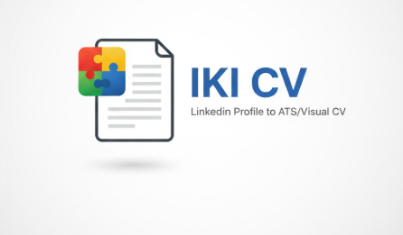

# 🚀 IKI CV: LinkedIn Profile to ATS/Visual CV

#  IKI CV

> **LinkedIn Profile to ATS/Visual CV**

**IKI CV** adalah ekstensi Google Chrome yang dikembangkan untuk mempermudah pembuatan CV profesional langsung dari data LinkedIn. Ekstensi ini sangat berguna bagi mahasiswa yang ingin memiliki CV bersih dan ATS-friendly tanpa harus menyusun ulang dari nol.

## ✨ Fitur Unggulan

* **Sistem Accumulator (Memoization)**: Simpan data secara bertahap. Kamu bisa mengambil profil di halaman utama, lalu pindah ke halaman detail untuk mengambil pendidikan/skill tanpa menimpa data sebelumnya.
* **Live Editing Mode**: CV yang dihasilkan bisa diedit langsung di browser (cukup klik pada teks) untuk memperbaiki salah ketik atau menghapus bagian yang tidak perlu sebelum di-print.
* **Pembersih Data Otomatis**: Secara cerdas menyaring label duplikat seperti "Skills:" yang sering mengotori hasil ekstraksi di LinkedIn.
* **Format ATS-Friendly**: Fokus pada keterbacaan sistem rekrutmen perusahaan.

---

## 🛠️ Langkah-Langkah Instalasi

Karena ekstensi ini belum ada di Chrome Web Store, kamu harus memasangnya secara manual melalui **Developer Mode**:

1. **Download Source Code**: Unduh repositori ini dan ekstrak foldernya (pastikan berisi `manifest.json`, `popup.html`, `content.js`, dll).
2. **Buka Kelola Ekstensi**: Buka Chrome dan ketik `chrome://extensions/` di address bar.
3. **Aktifkan Developer Mode**: Geser sakelar **Developer mode** di pojok kanan atas ke posisi **On**.
4. **Load Unpacked**: Klik tombol **Load unpacked** di pojok kiri atas.
5. **Pilih Folder**: Pilih folder proyek **IKI CV** yang sudah kamu ekstrak tadi. Ekstensi sekarang akan muncul di daftar Chrome kamu.

---

## 📖 Panduan Penggunaan (Metode Cicil Data)

Agar CV kamu lengkap dan Summary terekstrak dengan benar, ikuti urutan ekstraksi berikut ini:

### Langkah 1: Ekstrak Profil Utama & Summary

1. Buka profil LinkedIn kamu (URL: `linkedin.com/in/username/`).
2. Scroll ke bagian **About**. Jika teksnya panjang, klik **"...see more"** agar teks terbuka sepenuhnya.
3. Klik ikon IKI CV di bar ekstensi, lalu klik **Extract LinkedIn Profile**.
4. Pastikan di kotak JSON muncul data `name`, `headline`, dan `summary` kamu.

### Langkah 2: Ekstrak Pendidikan (Halaman Detail)

1. Di halaman LinkedIn kamu, klik **"Show all educations"** (biasanya ada di bagian bawah section Education).
2. Setelah berpindah halaman ke daftar pendidikan lengkap, klik tombol **Extract LinkedIn Profile** lagi pada ekstensi.
3. Data pendidikan akan otomatis ditambahkan ke memori penyimpanan.

### Langkah 3: Ekstrak Skills & Sertifikasi (Halaman Detail)

1. Lakukan hal yang sama: klik **"Show all skills"** atau **"Show all certifications"**.
2. Pada halaman detail tersebut, klik kembali tombol **Extract LinkedIn Profile**.
3. Ulangi hingga semua bagian yang kamu inginkan terekstrak.

### Langkah 4: Finalisasi & Download

1. Klik tombol **Generate ATS CV** pada popup ekstensi.
2. **Edit Langsung**: Jika ada teks `undefined` atau salah ketik, klik langsung pada teks tersebut di halaman CV untuk mengubah atau menghapusnya.
3. **Download**: Klik tombol **Download PDF** untuk menyimpan CV kamu.

---

## ⚠️ Troubleshooting

* **Tombol Tidak Responsif?** Segarkan (Refresh/F5) halaman LinkedIn kamu dan coba lagi.
* **Data Berantakan?** Klik tombol **Reset All Data** pada popup untuk membersihkan memori dan mulai ekstraksi dari Langkah 1.

---

Dibuat oleh **Muhammad Fahmi Ilmi** - IKI AKU.

---
